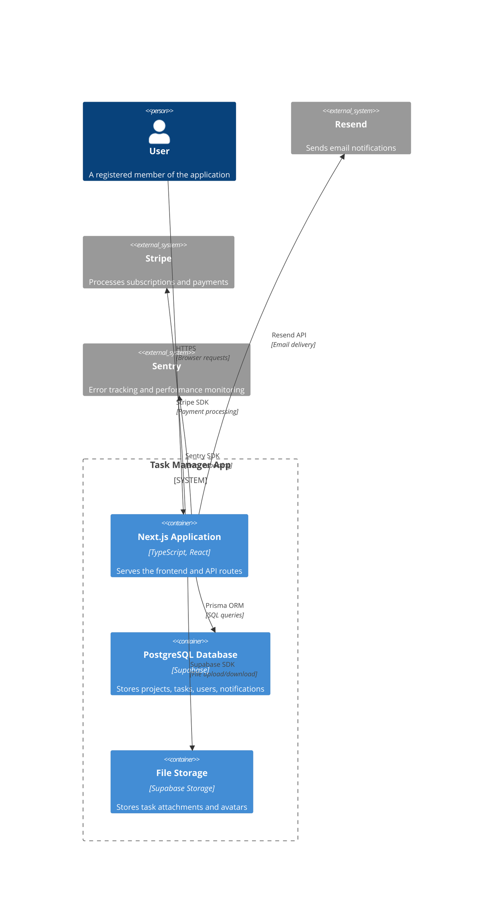

# OpenCode Specification Format

This document defines the contract between FoundryForge and OpenCode for automated code generation. The specification format described here is the output that FoundryForge must produce for every project request. OpenCode (or any code-generation agent) must interpret this specification to produce production-quality code. The specification must be complete enough for generation but concise enough to avoid hallucinations, contradictions, or ambiguity.

## Specification Sections

A valid FoundryForge specification contains the following sections in order. Every section must be present even if the value is "None" or "Not applicable." Omitted sections create ambiguity about whether the feature was considered and rejected or simply forgotten.

### 1. Executive Summary

A three-to-five paragraph overview of the project. The executive summary must answer: what is being built, who is the target user, what problem does it solve, and what is the primary business outcome.

This section is not aspirational marketing copy. It must describe actual functionality. Phrases like "revolutionary AI-powered platform" are forbidden. "A subscription-based dashboard for small-business owners to track monthly recurring revenue from three payment providers" is acceptable.

```
Executive Summary:
A team task management application for remote engineering teams of 5-50 people.
Users create projects, assign tasks with deadlines, and track progress through
a Kanban board view. The primary differentiator is automated standup summaries
generated from task status changes. The application collects a flat monthly fee
with no per-user pricing.
```

### 2. Requirements

Requirements are divided into functional and non-functional categories. Each requirement must be testable — it must be possible to write a pass/fail test for each one. Requirements should be numbered for traceability.

#### Functional Requirements

Functional requirements describe specific behaviors the system must exhibit. Write them as "The system shall..." statements with measurable outcomes.

```
FR-01: The system shall allow users to create projects with a name, description,
      and color label.
FR-02: The system shall allow users to invite team members to a project via
      email address.
FR-03: The system shall send a notification to all project members when a task
      status changes.
FR-04: The system shall generate a daily standup summary at 9 AM in each
      member's timezone.
```

Write each requirement as a single capability. Do not combine multiple behaviors into one requirement — if a test for one part fails, the entire requirement fails.

#### Non-Functional Requirements

Non-functional requirements describe quality attributes: performance, security, scalability, availability, and maintainability.

```
NFR-01: The application shall load the initial page within 2 seconds on a
      3G mobile connection.
NFR-02: The application shall support 500 concurrent users without degrading
      response time below 500ms for API requests.
NFR-03: User passwords shall be hashed using bcrypt with a cost factor of at
      least 12.
NFR-04: The application shall achieve a Lighthouse accessibility score of at
      least 95.
```

Non-functional requirements must be specific and measurable. "Fast" is not a requirement. "API response time under 200ms at the 95th percentile" is a requirement.

### 3. Actors

Describe every type of user or system that interacts with the application. Each actor has a name, a brief description, and a list of goals they accomplish using the system.

```
Unregistered Visitor: A person who has not created an account. Can view the
marketing landing page and pricing. Cannot access any application features.

Registered Member: A person with an account. Can create projects, manage tasks,
invite collaborators, and view standup summaries. Has access to their own
projects and projects they are invited to.

Project Admin: A member who created the project. Can delete the project, remove
members, and change project settings. Each project has at least one admin.

Billing System (External Actor): Stripe webhook endpoint that sends payment
events. Creates subscriptions, processes payments, and sends invoice data.
```

Actor definitions guide the permission model and the feature set. If you find yourself adding a feature that no actor needs, remove the feature.

### 4. Tech Stack

List the specific technologies, frameworks, libraries, and services the project will use. This section eliminates ambiguity during code generation — the generated code must use the specified stack, not a different one that the generation agent prefers.

```
Frontend:
  Framework: Next.js 14 (App Router)
  Language: TypeScript 5.4
  Styling: Tailwind CSS 3.4
  State Management: TanStack Query 5 for server state
  Client State: Zustand 4 (only for UI state that isn't server or URL state)
  Forms: React Hook Form 7 with Zod validation
  Testing: Vitest + React Testing Library

Backend:
  Runtime: Next.js API routes (co-located with frontend)
  ORM: Prisma 5
  Database: PostgreSQL 16 (via Supabase)
  Authentication: NextAuth.js v5 with credentials + Google OAuth
  File Storage: Supabase Storage
  Email: Resend

Infrastructure:
  Hosting: Vercel (Pro plan)
  CI/CD: GitHub Actions
  Monitoring: Sentry
  Analytics: PostHog
```

Include version numbers where possible. Version pinning prevents surprises when a library changes its API between major versions.

### 5. Architecture

Describe the system architecture at C4 Level 2 (Container diagram). Include a Markdown-based C4 diagram using Mermaid syntax, then explain the data flow for the three most critical user journeys.

```


Follow the diagram with data flow descriptions for key user journeys. Each data flow description should trace a complete request from user action to database write and response.

```
Data Flow: Create a Task
1. User fills the task creation form and clicks "Create"
2. React Hook Form validates fields using Zod schema
3. TanStack Query mutation sends POST /api/tasks to Next.js API route
4. API route verifies the user's session via NextAuth
5. API route authorizes that the user is a member of the target project
6. Prisma inserts the task row into the tasks table, linking it to the project and creator
7. API route calls notificationService to create an in-app notification for project members
8. API route returns the created task object with 201 status
9. TanStack Query invalidates the tasks query cache for the project
10. UI updates optimistically from the mutation response
```

### 6. Pages

Enumerate every page in the application with its route, purpose, and key components. This section is the primary input for generating page files and route configuration.

| Route | Page Name | Purpose | Key Components |
|---|---|---|---|
| / | LandingPage | Marketing landing page | HeroSection, FeatureGrid, PricingTable, Testimonials |
| /auth/signin | SignInPage | User sign-in | SignInForm (email/password + Google OAuth) |
| /auth/signup | SignUpPage | User registration | SignUpForm |
| /dashboard | DashboardPage | Main dashboard after login | ProjectGrid, RecentActivity, QuickActions |
| /projects/[id] | ProjectDetailPage | Single project view | KanbanBoard, TaskList, ProjectHeader, MemberList |
| /projects/[id]/settings | ProjectSettingsPage | Edit project settings | ProjectSettingsForm, DangerZone (delete project) |
| /settings | UserSettingsPage | User profile and preferences | ProfileForm, NotificationPreferences, ThemeSelector |

Each page entry must be explicit enough that a code generator can produce the page file and route configuration without guessing.

### 7. Components

List every reusable component required by the application. Components are organized by category. Each component entry includes its props interface, states (loading, empty, error, success, edge cases), and the data it requires.

This section feeds the Component Inventory (FF-021). The enumeration must be complete — every component used on every page must appear here. If a component appears on multiple pages, it must be listed in the Global section.

```
Global Components:
  Button
    Props: { variant: 'primary' | 'secondary' | 'ghost' | 'danger', size: 'sm' | 'md' | 'lg', isLoading: boolean, disabled: boolean, children: ReactNode, onClick: () => void }
    States: default, hover, active, disabled, loading (shows spinner, disables click)
    Notes: Must support asChild pattern for link buttons

  Modal
    Props: { isOpen: boolean, onClose: () => void, title: string, size: 'sm' | 'md' | 'lg', children: ReactNode }
    States: open (with backdrop), closed (not rendered)
    Behavior: Focus trap, Escape to close, click backdrop to close, return focus on close

  EmptyState
    Props: { icon: ReactNode, title: string, description: string, action?: { label: string, onClick: () => void } }
    States: with action button, without action button
    Notes: Used when lists have no items

  ErrorBoundary
    Props: { fallback?: ReactNode, onError?: (error: Error) => void }
    States: normal (renders children), error (renders fallback or default error UI)
    Behavior: Logs error to Sentry via onError callback

  LoadingSkeleton
    Props: { variant: 'card' | 'list' | 'table' | 'text', count?: number }
    Notes: Implements skeleton screen pattern with pulse animation
```

### 8. Routes

List all API routes with their HTTP methods, path parameters, query parameters, request body, response body, and authentication requirements.

```
POST /api/auth/signin
  Auth: None
  Body: { email: string, password: string }
  Response 200: { user: User, token: string }
  Response 401: { error: "Invalid credentials" }
  Notes: Rate-limited to 5 attempts per IP per minute

GET /api/projects
  Auth: Required (session token)
  Query: { page?: number, limit?: number, search?: string }
  Response 200: { data: Project[], total: number, page: number }
  Notes: Returns only projects the authenticated user is a member of

POST /api/projects
  Auth: Required (session token)
  Body: { name: string, description?: string, color?: string }
  Response 201: Project
  Notes: Creator is automatically added as Project Admin

GET /api/projects/[projectId]
  Auth: Required + Project Membership
  Response 200: Project (with member list and task count)
  Response 403: { error: "Not a member of this project" }
```

Route specifications eliminate ambiguity about endpoint contracts. The code generator produces exactly these endpoints with exactly these request and response shapes.

### 9. Database

Define the database schema using Prisma syntax or a database-agnostic table definition format. Include all tables, columns, types, constraints, indexes, and relationships.

```
model User {
  id            String    @id @default(cuid())
  email         String    @unique
  name          String?
  avatarUrl     String?
  passwordHash  String
  createdAt     DateTime  @default(now())
  updatedAt     DateTime  @updatedAt

  ownedProjects Project[] @relation("ProjectOwner")
  tasks         Task[]
  notifications Notification[]
  accounts      Account[]  // NextAuth accounts
  sessions      Session[]  // NextAuth sessions
}

model Project {
  id          String   @id @default(cuid())
  name        String
  description String?
  color       String   @default("#3B82F6")
  createdAt   DateTime @default(now())
  updatedAt   DateTime @updatedAt

  ownerId String
  owner   User   @relation("ProjectOwner", fields: [ownerId], references: [id])

  members ProjectMember[]
  tasks   Task[]
}
```

Include database indexes for all query patterns described in the requirements. Missing indexes are a common source of production performance issues.

### 10. APIs and Services

List every service module with its public methods, parameters, return types, and the external integrations it depends on. This section maps to the Service Planning document (FF-016).

```
AuthService
  Methods:
    signIn(email: string, password: string): Promise<{ user: User, token: string }>
    signUp(email: string, password: string, name: string): Promise<{ user: User, token: string }>
    verifySession(token: string): Promise<User>
    refreshToken(token: string): Promise<{ token: string }>
  Integrations: NextAuth.js, Resend (for welcome email on signup)

NotificationService
  Methods:
    sendInAppNotification(userId: string, type: NotificationType, data: object): Promise<void>
    sendEmail(userId: string, template: EmailTemplate, data: object): Promise<void>
    getNotifications(userId: string, page: number): Promise<PaginatedResult<Notification>>
  Integrations: Resend (email), In-app notification table (database)
```

### 11. Folder Structure

Provide the exact folder tree that the project must follow. Reference the Folder Structure Standards (FF-015) for the canonical structure. Any deviations from the standard must be explicitly documented here.

```
src/
├── app/                    # Next.js App Router pages
│   ├── layout.tsx
│   ├── page.tsx
│   ├── dashboard/
│   ├── projects/[id]/
│   └── api/
├── components/
│   ├── ui/                 # Primitives
│   ├── layout/             # Header, Sidebar, Footer
│   ├── forms/              # SignInForm, SignUpForm, ProjectForm
│   └── dashboard/          # ProjectGrid, RecentActivity
├── hooks/
├── services/
├── contexts/
├── lib/
├── types/
└── utils/
```

### 12. Security Checklist

A project-specific security checklist derived from OWASP Top 10 and common vulnerability patterns. Each item must be confirmed before release.

```
Security Checklist:
- [ ] All API routes validate user authentication (401 on missing/invalid token)
- [ ] All API routes that access resources validate authorization (403 on insufficient permissions)
- [ ] Input validation is performed server-side (Zod schemas on all POST/PUT/PATCH routes)
- [ ] SQL injection prevented via parameterized queries (Prisma ORM)
- [ ] XSS prevented via React's automatic escaping and Content Security Policy header
- [ ] CSRF protection via NextAuth.js built-in CSRF token
- [ ] Rate limiting applied to authentication endpoints (5 attempts/minute)
- [ ] File uploads restricted to allowed types (images: jpg, png, webp; max 5MB)
- [ ] Passwords hashed with bcrypt (cost factor 12)
- [ ] HTTPS enforced on all connections
- [ ] Environment variables used for all secrets (no hardcoded keys)
- [ ] npm audit passed with no critical or high vulnerabilities
```

### 13. Roadmap

The implementation roadmap divides the specification into phases. Phase 1 must produce a working end-to-end application. Later phases add features, polish, and optimization. Each phase includes a list of requirements and components that must be implemented.

```
Phase 1 (MVP - Week 1-2):
  Requirements: FR-01 through FR-08 (auth, projects, tasks, basic Kanban)
  Components: Button, Input, Modal, EmptyState, LoadingSkeleton, SignInForm,
              SignUpForm, ProjectCard, KanbanBoard, TaskCard, Header, Sidebar
  Pages: LandingPage, SignInPage, SignUpPage, DashboardPage, ProjectDetailPage

Phase 2 (Notifications - Week 3):
  Requirements: FR-09 through FR-12 (notifications, standup summaries)
  Components: NotificationBell, NotificationList, StandupSummaryCard

Phase 3 (Polish - Week 4):
  Non-functional Requirements: NFR-01 through NFR-04 (performance, accessibility, SEO)
  Accessibility audit and remediation
  Performance optimization (lazy loading, image optimization, bundle analysis)
```

### 14. Acceptance Criteria

A list of scenarios that must pass for the project to be considered complete. Each criterion maps to one or more requirements and includes the test approach.

```
AC-01 (FR-01): A user can create a project. Given a signed-in user, when they
submit the project creation form with valid data, the project appears in their
dashboard. Test: e2e test with Playwright.

AC-02 (FR-04): Daily standup summaries are generated. Given a project with
active tasks, when the clock reaches 9 AM in a member's timezone, the member
receives a standup summary. Test: Unit test for the cron job logic with mocked
timezone data.

AC-03 (NFR-01): Page load under 2 seconds on 3G. Test: Lighthouse CI test with
3G throttling on the dashboard page.
```

## Do's and Don'ts

**Do** write specifications at a level of detail where a mid-level developer could implement each section without asking clarifying questions. If a section requires interpretation, it needs more detail.

**Don't** include speculative features or aspirational architecture. Every element of the specification must correspond to a requirement, an actor, or a technical constraint. Speculative features increase generation complexity without adding value.

**Do** validate specifications by tracing a single user flow through all sections. Create a task as an admin, follow it from Pages (which page hosts the form) through Routes (which API endpoint receives it) through Database (which table stores it) through Services (which service orchestrates the logic). Any break in the trace is a specification gap.

**Don't** contradict the canonical standards (FF-015 through FF-019). If a specification deviates from the standard folder structure or state management guidelines, the deviation must be explicitly documented and justified.
